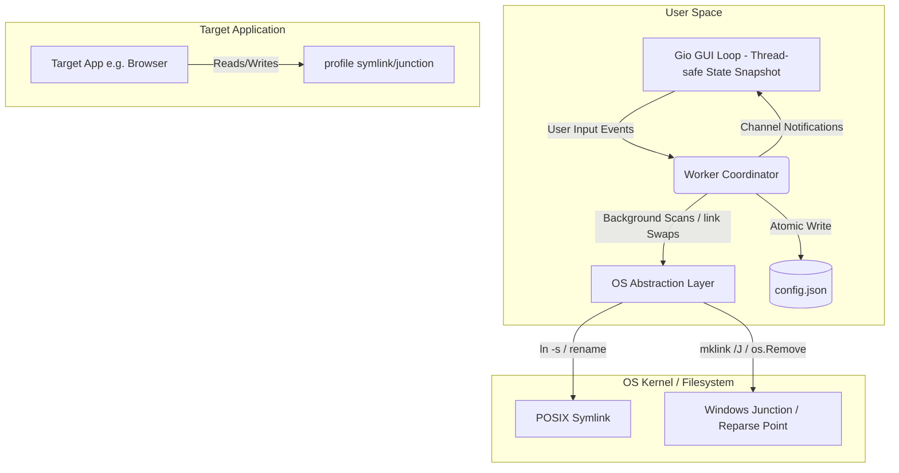
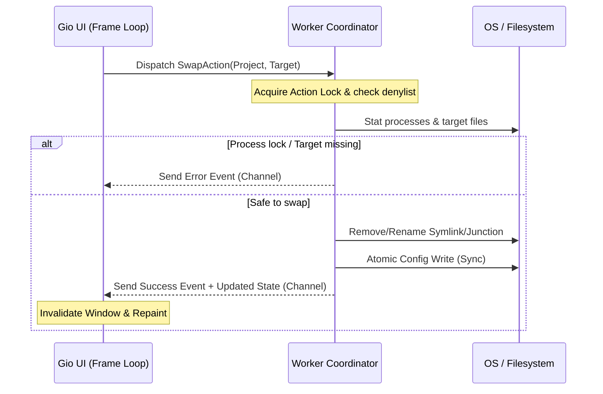

# Architecture Plan: Zen-Cycle GUI

A cross-platform (Windows, macOS, Linux) Go application utilizing Gio (gioui.org) for a clean, minimal GUI. The app enables users to switch between multiple folder structures (e.g., account/profile directories) by updating a symbolic link or junction point.

---

## 1. System Boundaries and Component Breakdown

The system is partitioned into a single-instance UI process, a concurrent IO coordinator, and the OS filesystem layer.



---

## 2. Data Flow and State Management

Gio is an immediate-mode UI. State updates must be completely decoupled from the main frame execution thread to prevent UI freezing (especially under heavy AV scanning or slow filesystem mounts).



### State Thread-Safety Architecture (Go Pseudocode)

```go
// AppState acts as the Single Source of Truth (SSOT) read by the UI.
type AppState struct {
	mu         sync.RWMutex
	Projects   []ProjectConfig
	ActiveID   string
	IsScanning bool
	Errors     []string
}

// Snapshot returns a shallow copy of the state for UI rendering,
// eliminating layout-stage locking contention.
func (s *AppState) Snapshot() AppStateSnapshot {
	s.mu.RLock()
	defer s.mu.RUnlock()
	return AppStateSnapshot{
		Projects:   append([]ProjectConfig{}, s.Projects...),
		ActiveID:   s.ActiveID,
		IsScanning: s.IsScanning,
		Errors:     append([]string{}, s.Errors...),
	}
}
```

---

## 3. Cross-Platform Symlinking & Junction Logic

The strategy adapts to OS privileges and filesystem types dynamically:

| Platform | Filesystem Type | Target Type | Abstraction Method | Privilege Requirement |
| :--- | :--- | :--- | :--- | :--- |
| **Linux/macOS** | Any POSIX | Dir / File | Relative Symlink via temp-rename | None |
| **Windows** | NTFS | Dir | Directory Junction (`mklink /J`) | None |
| **Windows** | NTFS | File / Dir | Symlink (`CreateSymbolicLinkW`) | Dev Mode / Admin |
| **Windows** | exFAT / FAT32 | Dir | Copy/Sync Fallback (with warning) | None |

### Abstraction Pseudocode (Go)

```go
func createLink(target, link string) error {
	if runtime.GOOS != "windows" {
		// POSIX: Atomic swap via temporary symlink + rename
		tmpLink := link + ".tmp"
		_ = os.Remove(tmpLink)
		if err := os.Symlink(target, tmpLink); err != nil {
			return err
		}
		return os.Rename(tmpLink, link)
	}

	// Windows implementation
	absTarget, err := filepath.Abs(target)
	if err != nil {
		return err
	}
	absLink, err := filepath.Abs(link)
	if err != nil {
		return err
	}

	// Junctions require absolute target path and must be NTFS
	isNTFS, err := checkNTFS(filepath.Dir(absLink))
	if err != nil || !isNTFS {
		return fmt.Errorf("junctions require an NTFS volume: %v", err)
	}

	// Clean up old link/junction (MoveFileEx replace doesn't work on junctions)
	if err := removeReparsePoint(absLink); err != nil && !os.IsNotExist(err) {
		return fmt.Errorf("failed to clear existing target: %w", err)
	}

	// Fallback path: Use cmd.exe mklink /J (requires no admin privileges)
	cmd := exec.Command("cmd", "/c", "mklink", "/J", absLink, absTarget)
	if output, err := cmd.CombinedOutput(); err != nil {
		return fmt.Errorf("mklink failed: %s - %w", string(output), err)
	}
	return nil
}

func removeReparsePoint(path string) error {
	fi, err := os.Lstat(path)
	if err != nil {
		return err
	}
	if fi.Mode()&os.ModeSymlink != 0 {
		return os.Remove(path)
	}
	// On Windows, directories marked as junctions must be removed via os.Remove
	return os.Remove(path)
}
```

---

## 4. Failure Modes and Mitigations

### A. Windows Administrative Privileges Block
* **Risk**: Windows users typically run without Developer Mode or admin elevation, making `os.Symlink` return `ErrPermission`.
* **Mitigation**: Use Directory Junctions (`mklink /J`) for Windows folder cycling. Junctions bypass admin requirements on NTFS. Show an error banner only if directory target is on FAT32/exFAT (which do not support reparse points).

### B. In-Use Handle & Split-Brain Writes
* **Risk**: If the target application (e.g., Discord) is running, some files remain open. Deleting the symlink will fail with a sharing violation, or new files will write into the newly linked folder while old handles write to the old target.
* **Mitigation**: 
  1. Maintain a process denylist per project configuration (e.g. `["discord.exe", "Discord"]`).
  2. Verify no denylist processes are running before switching links using lightweight process queries (`tasklist` on Windows, `pgrep` on Linux/macOS).
  3. If processes are active, abort the swap and request user confirmation to force-close.

### C. Gio GUI Jank on File Operations
* **Risk**: File operations (stat, mkdir, mklink) can block the immediate-mode UI main thread for hundreds of milliseconds.
* **Mitigation**: Offload all IO tasks and directory listings to a background goroutine worker channel. Update the UI state using thread-safe channels (`chan Event`) and fire `window.Invalidate()` only upon transaction completion.

### D. config.json Corruption
* **Risk**: Sudden power loss or crash during a config write leaves `config.json` half-written.
* **Mitigation**: 
  1. Write atomically: Create a temp file `.config-*.tmp` inside the **same directory** as the config (guaranteeing same filesystem/volume boundary).
  2. Flush OS write buffers with `file.Sync()`.
  3. Rename/Replace target (`os.Rename`).
  4. If `config.json` reading fails on launch, read `config.json.bak` or backup current corrupted state and fall back safely instead of panicking.

### E. Single-Instance Double-Write Races
* **Risk**: Two concurrent app instances attempting to swap symlinks create filesystem deadlock or race conditions.
* **Mitigation**: Require a lockfile (`config.lock`) using platform-native flock or named mutex (Windows) to enforce single-instance lifecycle.

---

## 5. Key Decisions & Tradeoffs

### Decision: Symlink/Junction Swaps vs Copy-Sync (e.g., Robocopy/rsync)
* **Alternative**: Maintain physical folders and copy files to a fixed target path on demand.
* **Tradeoff**:
  * *Copy-Sync Advantage*: No administrative/privilege hurdles, works across FAT32/network shares natively.
  * *Copy-Sync Disadvantage*: High I/O overhead. Multi-gigabyte browser databases or profiles create heavy disk wear and cause long swap delays.
* **Resolution**: Choose Symlink/Junction swapping for instant switching. Use Copy-Sync only as a fallback notification warning when the filesystem does not support reparse points.

### Decision: Custom Go Binary with Gio vs Bash/Batch Wrappers
* **Alternative**: Maintain simple command-line scripts.
* **Tradeoff**:
  * *Script Advantage*: Zero compilation overhead, extremely small size.
  * *Script Disadvantage*: Hostile UX for non-technical users, platform-specific code duplication, lacks background status auditing.
* **Resolution**: Proceed with a unified Go/Gio application to provide cross-platform consistency and reliable file-handle protection.

---

## 6. Red-Team Critique Summary

The following critiques from `browser.chat` have been integrated:
* **Junction Capabilities**: Corrected assumptions. Clarified that junctions support cross-volume targets on local NTFS disks, but fail on FAT32/exFAT and network UNC paths. (*Folded in*).
* **Relative vs Absolute paths**: Windows Junction targets are stored internally as absolute paths. Moving the root folder breaks Windows junctions silently. Added warning state to UI when target directory paths change. (*Folded in*).
* **Split-Brain File Corruption**: Highlighted risks of swapping while process handles are active. Added the process denylist lookup mitigation. (*Folded in*).
* **Atomic Windows Swapping**: Clarified that directory junctions on Windows require a delete-then-create sequence rather than an atomic rename. Added a retry-loop with exponential backoff on sharing violations. (*Folded in*).
* **Config Syncing**: Added `file.Sync()` constraint before file close in atomic writes. (*Folded in*).

---

## 7. Open Questions

1. **Portable Directory Detection**: If the executable resides on a shared USB drive, should paths inside `config.json` be saved relative to the configuration file rather than absolute to support cross-machine drive letter shifts?
   * *Confidence*: 90% sure that resolving target paths relative to the `config.json` location is required for true portability.
Just activate skills id=portable-design, it will shows you perfect design